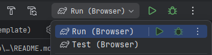

# kotlin-js-template

A GitHub repository template for a bare-bone Kotlin/JS-based browser application.

## What's included

- Gradlew-wrapper-based project
- No frontend frameworks, just vanilla JS
- Kotlin 2.1.20
- Test infrastructure based on Karma + headless Chromium
- Basic CI/CD
- Dependabot weekly checks

## How to use

### Prerequisites

You need JDK 21 installed to be able to build and run the template project.

### Creating repository

- Tap the [Use this template](https://github.com/new?template_name=kotlin-js-template&template_owner=seclerp) button
- Complete repository creation using the template
- Wait a couple of seconds until the Template Cleanup workflow does its job
- Clone a re-initialized repository

### IntelliJ IDEA

Use **Run (Browser)** and **Test (Browser)** pre-configured run configurations to run and test your app accordingly:




### Command line

To build and run your app use 
```shell
./gradlew :jsBrowserDevelopmentRun
```

To run tests use
```shell
./gradlew :jsBrowserTest
```

> [!TIP]
> You can find more information about running and testing your Kotlin/JS app in the official documenation pages:
> - [Kotlin Docs: Run Kotlin/JS](https://kotlinlang.org/docs/running-kotlin-js.html)
> - [Kotlin Docs: Run tests in Kotlin/JS](https://kotlinlang.org/docs/js-running-tests.html)